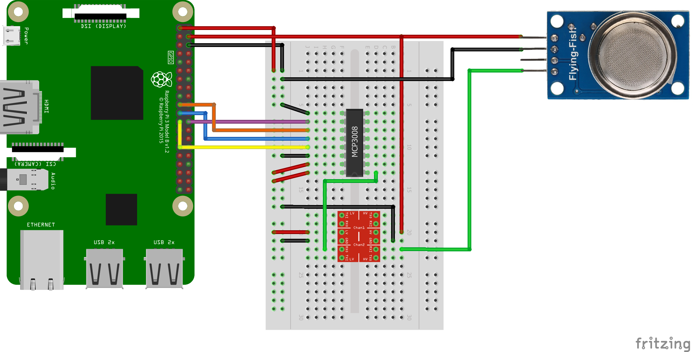
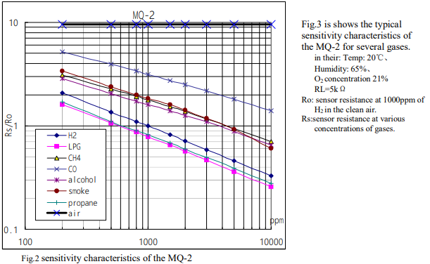
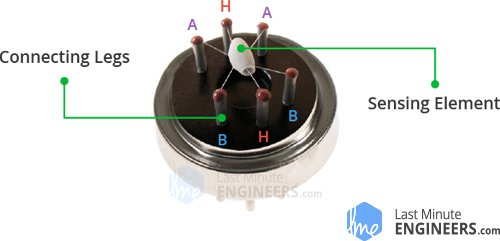
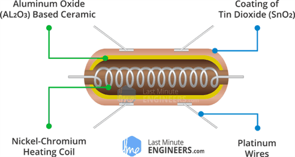
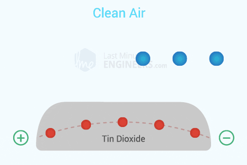
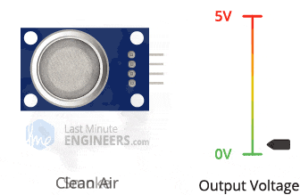
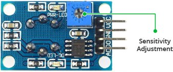

## MQ Sensor

### Facts/Things to know about MQ-2 Gas Sensor

#### Cabling

- First the cable layout for the sensor: 
    - One difference is that I use a different kind of logic level convertor, but it does the same thing.
    
- The red part is the logic level convertor. The sensor runs on 5 volts but the PI can't handle that, 
so the logic level convertor safely steps down the 5V signal to a 3.3V signal.
- The MCP3008 chip is an adc that we used to get the analog value from the sensor. 
  It is further explained in the MCP3008|ADC part.
  
#### How the gas sensor works

- First to clarify this sensor is a semiconductor of sorts also known as a Chemiresistor since its resistance is 
  based of change in chemicals

- Now lets talk about this graph. In simple terms this graph is used to read the values from the gas sensor, but 
there is a caveat to it and that is that all values in this graph are in Log values. so if you want to get the actual
  x value from the graph for example to do a math equation using it you need to get the log(x) of it.
  There is another caveat and that is also mentioned in the code, but the gas sensor is not accurate enough to get all
  gasses shown in the graph. Theoretically it is possible, but you need factory grade calibration to get them perfectly.
  Which is why in the code only LPG, CO and Smoke are used because they are somewhat far apart and so it is more of a
  generalized value than an accurate one.
  

- Now to how the sensor internally works: 

- The sensor has an outer layer which is made of stainless steel mesh (anti explosion network) and clamped down with the 
outer ring. Its purpose is to not cause an explosion when the sensor heats up which it needs to do to function. 
- On the inside there is the sensing element which is seen in the second picture. The A and b cables are used
to get the signal from the element and the H nickel coil is used to heat the element. It is easier to see in the 
  next picture.
  

- So as was seen on the first graph, the sensor has the highest resistance in clean air. The way the sensor works 
is by heating the element till the oxygen density rises which causes the resistance to rise.
  
- To give an example of how this affects the output voltage of the sensor you can look at the next gif.

- It is possible to use the sensitivity adjustment screw on the back of the sensor to calibrate it, but that is
  only usable if you put it said gas and calibrate it manually and if you want to use it for detecting a single gas. 
  

- For more information and the links to the datasheet (not all of them are made equal) check the following:

[More info on the sensor and simple example](https://lastminuteengineers.com/mq2-gas-senser-arduino-tutorial/)

[Datasheet MQ-2 Sensor](http://sandboxelectronics.com/files/SEN-000004/MQ-2.pdf)

[More explaining of the graph and a more complex example](https://ioct.tech/edu/sites/default/files/2019-04/MQ-2%20Gas%20Sensor%20-%20Informational.pdf)

### Methods

- `get_sensor_resistance(analog_input)`
    - This method is used to find to get the resistance of the sensor at the moment.
    This is technically also how you read the sensor since the resistance value is the value which you're getting back.
    - `analogInput` Stands for the input from the ADC so in this case it's the MCP3008.
      
- `sensor_calibration()`
    - This method is for calibrating the gas sensor.
    - It takes a number of samples over a period of time of depending on the average it gives back the
    current Ro value from the sensor.
      - R0 is the value of the sensor in clean air. 
    
- `read_rs_value()`
    - This method is used to read the sensor
    - It takes a number of samples and gives the average so
    that the values given are somewhat more consistent and don't fluctuate too fast.

- `calculate_ppm_gas(gas_curve)`
    - This method calculates the ppm (parts per million) of each gas depending on the gas curve/graph
    passed in the argument field `float gascurve[]`.
      
- `def get_ppm(gas_number)`
    - This method uses the previous method and gives back the ppm of the gas depoending on 
    the `gasNumber` (different number for each gas) given. 
      
- `def get_gas_strings(self, gas_number)`
    - This method is the same as the previous one but it returns a string with the name + value.
  
## MCP3008

### Methods

- `def __init__(self, bus=0, device=0)`
  - In the constructor the bus(the pin on the adc that is used) and device 
    (since SPI can have multiple slaves this is for choosing the first device) are defined as class
    variables.
    
- `open()`
  - This method is for opening a connection with the adc and setting the max speed to 1 MHz.
  
- `read(channel=0)`
  - This method uses bit shifting and the spi.xfer2 method to read from the adc though I
  cant elaborate further as I dont fully understand what this does. 
    
- `close()`
  - This method closes the connection with the adc.

[MCP3008 Datasheet](https://cdn-shop.adafruit.com/datasheets/MCP3008.pdf)